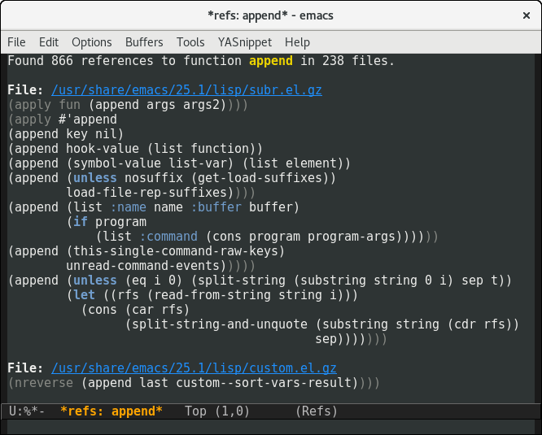

# elisp-elisp-refs.el
[](https://travis-ci.org/Wilfred/refs.el)
[](https://coveralls.io/github/Wilfred/refs.el?branch=master)

elisp-refs.el is an Emacs package for finding references to
functions, macros or variables. Unlike a dumb text search,
elisp-refs.el actually parses the code, so it's never confused by
comments or `foo-bar' matching `foo'.



This is particularly useful for finding all the places a function is
used, or finding examples of usage.

## Installation

Add elisp-refs.el to
`load-path`. [MELPA coming soon](https://github.com/melpa/melpa/pull/4274).

## Commands available

* `elisp-refs-function` (find function calls)
* `elisp-refs-macro` (find macro calls)
* `elisp-refs-variable` (find variable references)
* `elisp-refs-special` (find special form calls)
* `elisp-refs-symbol` (find all references to a symbol)

## Semantic analysis

elisp-refs.el has *street smarts*: given `(defun foo (bar) (baz))`, it
understands that `bar` is a variable and `baz` is a function.

elisp-refs.el understands the following forms:

* `defun` `defsubst` `defmacro` `cl-defun`
* `lambda`
* `let` `let*`
* `funcall` `apply`
* sharp quoted expressions

## Limitations

elisp-refs.el understands elisp special forms, and a few common
macros. However, it **cannot understand arbitrary macros**.

Therefore elisp-refs.el will assume that `(other-macro (foo bar))` is a
function call to `foo`. If this is incorrect, you may wish to use the
command `elisp-refs-symbol` to find all references to the `foo` symbol.

If `other-macro` is a common macro, please consider submitting a patch
to `elisp-refs--function-p` to make elisp-refs.el smarter.

elisp-refs.el also **does not support** indirect calls.

``` emacs-lisp
;; Since we do a simple syntax walk, this isn't treated as a
;; call to foo.
(let ((x (symbol-function 'foo)))
  (funcall x))

;; Similarly, pasing functions as arguments will not be treated
;; as function calls either.
(defun call-func (x)
  (funcall x))
(call-func 'foo)
```

## Running tests

You can run the tests with:

```
$ cask install
$ cask exec ert-runner
```

## Performance

elisp-refs.el is CPU-intensive elisp and has been carefully optimised. You
can run the benchmark script with:

```
$ cask install
$ ./bench.sh
```

New features are carefully measured to ensure performance does not get
worse.

See elisp-refs-bench.el for more details.

## Changelog

v1.0: Initial release.

## Alternative Projects

**TAGS**: It is possible to record function references in TAGS
files. Whilst [universal-ctags](https://github.com/universal-ctags/ctags) (formerly
known as exuberant-ctags) does provide the ability to find references,
it is not supported in its lisp parser.

etags, the TAGS implementation shipped with Emacs, cannot find
references (to my knowledge).

**el-search**:
[el-search](https://elpa.gnu.org/packages/el-search.html) allows you
to search for arbitrary forms in elisp files. It's slower, but a much
more general tool. Its design greatly influenced elisp-refs.el.
